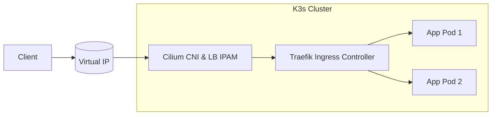
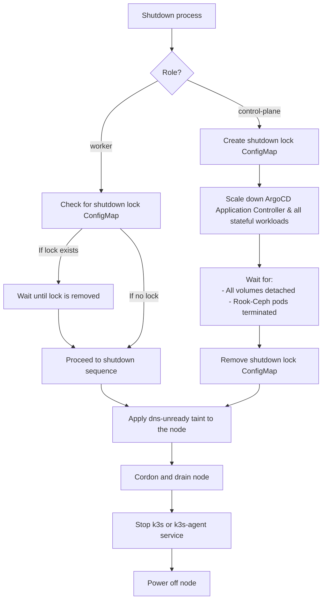
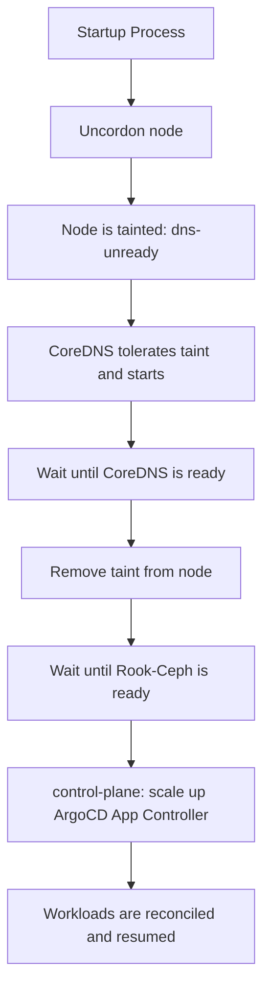

# Home K3s Cluster — Infrastructure as Code

This repository defines the **Infrastructure as Code (IaC)** setup for my intentionally over-engineered **K3s home cluster**.
It was built as a learning project to explore Kubernetes operations, but primarily serves to host personal workloads in a modular, automated, and reproducible environment.

The following tools form the foundation of the cluster's provisioning, configuration, and workload management:

## Core technologies

- **Ansible** – Used to bootstrap nodes, install dependencies, and configure system-level settings before joining the cluster.
- ~~**Terraform**~~ **OpenTofu** – Manages all cluster resources declaratively, including Helm releases, namespaces, secrets, and Argo CD applications.
- **K3s** – A lightweight Kubernetes distribution optimized for edge and home lab setups.
- **Helm** – Handles installation and configuration of complex applications via reusable charts.
- **Kubernetes Manifests** – Define workloads, services, ingress rules, and other cluster resources in YAML.

Here’s your updated **Cluster Components** section with a short, natural mention of your MikroTik-based home network and the link to your router configuration:

## Cluster components

The cluster consists of three physical nodes:

- 🐮 **cow** – Raspberry Pi 5 (8GB RAM)
  Acts as the **control-plane** node, managing cluster state and system components.

- 🐑 **sheep** – Raspberry Pi 5 (16GB RAM)
  Serves as a general-purpose worker, running core services and lightweight workloads.

- 🦆 **duck** – Lenovo ThinkCentre M910q (i7, 32GB RAM)
  Dedicated to AI workloads and compute-heavy tasks. Normally powered off and started on demand.

The cluster runs on my **MikroTik-based home network**. See the [network configuration and automation repository](https://github.com/Schwitzd/IaC-HomeRouter) for details.

## Networking

This cluster is configured as a **dual-stack environment**, supporting both IPv4 and IPv6 across all components.  
While I don’t strictly need IPv6 in my home network, I saw it as a great opportunity to learn and experiment with it in a real-world setup.

The networking stack is built around **Cilium**, which is responsible for:

- Providing **Container Networking (CNI)** using **eBPF**
- Replacing **kube-proxy** with eBPF-based service routing
- Managing **LoadBalancer IPs**, removing the need for an external component like MetalLB
- Enforcing **Kubernetes Network Policies**

### Network architecture

All cluster nodes are connected to a dedicated VLAN with the following addressing:

- **IPv4:** `192.168.14.0/26`
- **IPv6:** `fd12:3456:789a:14::/64`

The node's primary IPs are explicitly specified using the `--node-ip` K3s installation flag to ensure dual-stack support.

The Kubernetes **Pod and Service CIDRs** are defined for both address families:

| Purpose          | IPv4 CIDR            | IPv6 CIDR                   |
|------------------|----------------------|-----------------------------|
| Cluster Pods     | `10.42.0.0/16`       | `fd22:2025:6a6a:42::/104`   |
| Cluster Services | `10.43.0.0/16`       | `fd22:2025:6a6a:43::/112`   |

## Deployment workflow

### Preparing the nodes

Before deploying any workloads, we first need to prepare the Raspberry Pi nodes to host the K3s cluster. Inside the `ansible/` folder, you'll find two playbooks that handle the required system configuration.

Install the necessary Ansible roles and collections in order to use the playbooks:

```sh
cd ansible
ansible-galaxy role install -r requirements.yaml --force
ansible-galaxy collection install -r requirements.yaml --force
```

#### Set up SSH passwordless authentication

```sh
ansible-playbook -i inventory.yaml ssh-auth.yaml --extra-vars "target=<node-name>" -u k3s -c paramiko --ask-pass
```

This playbook performs the following:

- Generates an SSH key pair on the local machine (if not already present)
- Copies the public key to the target node and appends it to its ~/.ssh/authorized_keys
- Generates a temporary file in the directory `/tmp/<hostname-fqdn>_ed25519_passphrase.txt` that contains the passphrase

#### K3s pre-requirements

Next, we apply the system-level configuration required to run K3s on the Raspberry Pi nodes:

This playbook performs the following:

- Sets up and mounts a Btrfs volume for persistent storage
- Applies SSH hardening and restricts access to the `k3s` user
- Enables memory cgroups required by K3s
- Add third-party repositories for Helm and Kubectl, then install the required packages
- Configures K3s environment variables for image garbage collection
- Prepare disk device and kernel module required by Rook Ceph
- Sets up static IPv6 networking via NetworkManager
- Enables IPv6 forwarding for networking compatibility
- Deploys graceful shutdown and startup scripts + systemd units
- Configures and enables a cron job to automatically shut down the cluster safely

```sh
ansible-playbook -i inventory.yaml k3s.yaml --tag <tag-name>
```

Because the playbook `k3s.yaml` contains tasks that must be run before and after K3s installation, a controlled deployment is strongly suggested. Before installing K3s, run the following tags in order:

- sshd
- apt
- networking
- k3s-cgroup

Follow the [Installation](#installation) section to deploy K3s.  
Once K3s is installed, run the following Ansible tags in order:

- k3s-cilium
- k3s-rook-ceph
- k3s-post
- k3s-config
- shutdown-startup

Once Kubernetes has been installed and all the Ansible tags applied, we can start deploying resources to the cluster.

### Preparing OpenTofu

```sh
tofu init
tofu plan
```

## K3s

K3s is currently installed manually on each node using the official installation script. While automating this step with Ansible would be ideal, I opted for manual installation due to limited time and haven't yet explored what's already available in the community.

## Deploying resources

This section outlines the recommended order to deploy the **core services** into the K3s cluster.  
Following this sequence ensures proper service dependencies and seamless integration between networking, ingress, and TLS management components.

Some critical components must be available before **Argo CD** is installed, to support this, they follow a **dual deployment strategy**:

 1. Temporarily deployed using OpenTofu.
 2. Later imported into Argo CD for full GitOps lifecycle management.

### Installation

The following sections outline how both the **control-plane** and **worker** nodes are installed using the official K3s script.

```
## Master node
export K3S_KUBECONFIG_MODE="644"
export INSTALL_K3S_EXEC=" --disable-cloud-controller --disable=coredns --disable=servicelb --disable=traefik --secrets-encryption --flannel-backend=none --node-ip=<ipv4>,<ipv6> --cluster-cidr=<ipv4-range>,<ipv6-range> --service-cidr=<ipv4-range>,<ipv6-range> --kube-controller-manager-arg=node-cidr-mask-size-ipv6=120 --disable-network-policy --disable-kube-proxy --tls-san <cluster-fqdn>"

curl -sfL https://get.k3s.io | INSTALL_K3S_VERSION="<desired-version>" sh

## Worker node
# Get the node token
sudo cat /var/lib/rancher/k3s/server/node-token

# Installation
INSTALL_K3S_EXEC="--flannel-backend=none --node-ip=<ipv4>,<ipv6>"

curl -sfL https://get.k3s.io | INSTALL_K3S_VERSION="<desired-version>" K3S_URL=https://<RPI_NODE_HOSTNAME>:6443 K3S_TOKEN=<NODE_TOKEN> sh -
```

While it's not best practice to manage the cluster directly from the **control-plane** node, I do so here for the sake of simplicity and ease of local development.

To streamline day-to-day operations, I configure `kubectl` on the **control-plane** like this:

```sh
# Set up kubectl config
mkdir -p ~/.kube
sudo cp /etc/rancher/k3s/k3s.yaml ~/.kube/config
sudo chown $USER ~/.kube/config
sudo chmod 600 ~/.kube/config
export KUBECONFIG=~/.kube/config

# Optional: Enable kubectl autocompletion
echo "source <(kubectl completion bash)" >> ~/.bashrc
source ~/.bashrc
```

Once the **control-plane** node is installed, you will notice that it is in the `NotReady` state.This is expected, because no **CNI** is installed at this stage. To resolve this **Cilium** must be deployed to the cluster. But before doing this making sure that at least one **worker** node is already joined to the cluster so **Cilium** pods can be scheduled successfully.

First, go back to the [K3s Pre-requirements](#k3s-pre-requirements) section to provision the missing tags, then proceed with the deployment of **Cilium**.

### Secrets management

Secrets in my cluster are managed natively by K3s, using the `--secrets-encryption` flag during installation.
This flag enables **secret encryption at rest**, ensuring that all `Secret` resources are encrypted using AES-CBC with an auto-generated key stored on disk (typically at `/var/lib/rancher/k3s/server/tls`).

While this provides basic protection, it's important to understand the limitations:

- The encryption key is stored on disk, on the same machine as the data.
- Anyone with root access can potentially access and decrypt the secrets.
- Key rotation must be performed manually.

A more robust secret management system like Vault is on the roadmap.

### Networking with Cilium

Since **Cilium** is such a critical component of the cluster's networking stack, it must be deployed early in the cluster lifecycle, before any workloads or services can function properly.  
K3s is configured without a default CNI or kube-proxy, making the installation of Cilium the first essential step after setting up the nodes.

The deployment process follows the standard dual-step approach required when dealing with Kubernetes CRDs:

```sh
# Step 1: Install Cilium with CRDs
tofu apply --var-file=variables.tfvars --target=helm_release.cilium

# Step 2: Apply IPPool and L2 announcement CRs after CRDs are ready
tofu apply --var-file=variables.tfvars --target=kubernetes_manifest.cilium_ip
tofu apply --var-file=variables.tfvars --target=kubernetes_manifest.cilium_l2
```

> **Note**: `depends_on` is not sufficient in this case because OpenTOfu resolves CRDs during the planning phase — not at apply time. This is why the manifests must be applied in a separate step after Cilium is installed.

After deploying **Cilium** itself, we apply the fundamental network policies to allow the core workloads (like DNS, Ingress, and cert-manager) to communicate successfully:

```sh
tofu apply --var-file=variables.tfvars --target=kubernetes_manifest.network_policies
```

Once Argo CD is available, bring it under the management of GitOps, including the network policies:

```sh
# Cilium deployment in Argo CD
tofu apply --var-file=variables.tfvars --target=argocd_application.cilium

# Cilium network policies
tofu apply --var-file=variables.tfvars --target=argocd_application.cilium_policies
```

> ⚠️ **Keep in mind:** at this stage, the previous command only allows fundamental policies that enable the core services of the cluster to communicate with each other. However, I expect that some **Cilium policy violations** will occur. Please refer to the troubleshooting section, [Cilium network policies](#cilium-network-policies), for guidance on identifying and resolving these issues.
In addition, at the time of writing, the Hubble UI primarily focuses on pod-to-pod traffic. Dropped traffic originating from the `host` or `remote-node` may not be visible in the UI. For full visibility, including host-level and remote-node policy drops, use the **Hubble CLI**.

The **Cilium CLI** is installed automatically on the **control-plane** node via a dedicated **Ansible role**, allowing easy access to status and observability features like `cilium status` and `cilium monitor`.

### CoreDNS

**CoreDNS** acts as the internal DNS server for service discovery and cluster DNS resolution in K3s. It is deployed automatically by K3s during cluster installation. However, this deployment method has limitations with regard to service customisation. The complex logic that I developed to shut down or restart the cluster requires a toleration to be added to **CoreDNS**. For this reason, I chose to install CoreDNS using the official Helm chart instead of the K3s installation script.

Once **Argo CD** is up, bring it under GitOps management:

```sh
tofu apply --var-file=variables.tfvars --target=helm_release.coredns
```

Then import it into Argo CD:

```sh
tofu apply --var-file=variables.tfvars --target=argocd_application.coredns
```

### Certificates

To manage TLS certificates in the cluster, we use **Cert-Manager** with a **DNS-01 challenge**.
Due to how OpenTofu handles Kubernetes CRDs, `ClusterIssuer` cannot be applied until **Cert-Manager** is fully installed. OpenTofu needs CRDs to exist at plan time to resolve their types.

To deploy **Cert-Manager** and the `ClusterIssuer` correctly:

```sh
# Step 1: Install Cert-Manager with CRDs
tofu apply --var-file=variables.tfvars --target=helm_release.cert_manager

# Step 2: Deploy ClusterIssuer once CRDs are available
tofu apply --var-file=variables.tfvars --target=kubernetes_manifest.le_clusterissuer
```

> **Note**: `depends_on` is not sufficient here because OpenTofu resolves CRDs during the planning phase, not at apply time.

### Traefik ingress

All services in the cluster are exposed externally through **Traefik**, which acts as the **Ingress Controller**.
**Traefik** is configured to use LoadBalancer IPs provided by **Cilium**, making the setup simpler and more integrated.

To deploy Traefik initially with OpenTofu:

Deploy **Traefik** with LoadBalancer configuration:

```sh
tofu apply --var-file=variables.tfvars --target=helm_release.traefik
```

Later, import it into Argo CD:

```sh
tofu apply --var-file=variables.tfvars --target=argocd_application.traefik
```

The diagram below illustrates how external traffic reaches workloads in the cluster using **Cilium** for LoadBalancer IP management and **Traefik** as the Ingress Controller:



### ArgoCD

**ArgoCD** manages the desired state of all applications and infrastructure deployed to the Home K3s cluster, providing a GitOps workflow for automated and repeatable deployments.

**How ArgoCD is Integrated**:

- **Project and App Management**: Each major category of workload (e.g., databases, monitoring, system, registry) is isolated into its own ArgoCD Project for RBAC and resource scoping. Applications are registered declaratively using OpenTofu, referencing charts and values from either OCI Helm registries or private Git repos (maybe one day I will opensource it).

- **Secrets**: Sensitive values are never stored in Git. Instead, OpenTofu provisions all required Kubernetes Secrets before ArgoCD syncs the relevant application. Charts are configured to reference these pre-existing secrets using their existingSecret fields wherever supported.

- **Automated Sync**: Most system and core workloads are set to sync automatically. ArgoCD will monitor and automatically apply any updates to charts or values files, as well as self-heal if resources drift from the declared state.

To deploy ArgoCD:

```sh
tofu apply --var-file=variables.tfvars --target=helm_release.argocd
```

Then, create all ArgoCD Projects and assign their associated repositories:

```sh
tofu apply --var-file=variables.tfvars --target=argocd_project.projects
```

### Storage with Rook-Ceph

After experiencing countless issues with **Longhorn**, primarily due to corrupted PVCs for which I could find no clear explanation, I decided to replace it with **Rook-Ceph**.
It’s more complex to set up, but so far it has proven to be much more stable and reliable in my environment.

The default storage pool is named `haystack` because, just like a real haystack, it is where all the bulky, stateful data is stored. This is where your Persistent Volume Claims (PVCs) live — the persistent storage used by your workloads that need to remember things after a reboot.

To deploy **Rook-Ceph**:

```sh
tofu apply --var-file=variables.tfvars --target=argocd_application.rook_ceph
```

You can access the **Rook-Ceph** dashboard by retrieving the admin password using the following command:

```sh
kubectl -n rook-ceph get secret rook-ceph-dashboard-password -o jsonpath="{['data']['password']}" | base64 --decode && echo
```

### Garage

I decided to switch from MinIO to **Garage* after [MinIO's removal of key features from the community edition](https://github.com/minio/object-browser/pull/3509). MinIO is following a "Redis momentum" and almost all functionality are now available only in the enterprise tier. At the time of writing, **Garage** does not offer a web UI and can only be configured from the command line interface (CLI), unlike MinIO, which had a really nice web UI.

The deployment uses the same Argo CD strategy, but Garage requires a cluster layout before storing data. I automated this step using a Kubernetes job that runs upon initial installation, detects the node ID, and applies the layout.

The plan is to automate the process of creating the buckets, which are currently created manually using the CLI inside the container. The goal is to find a Tofu provider to automate this task.

### Other workflows

All other workloads in the cluster, including databases, monitoring tools, and supporting services follow the same deployment pattern:

They are defined as **Argo CD Applications** and deployed using the following command:

```sh
tofu apply --var-file=variables.tfvars --target=argocd_application.<app-name>
```

## Cluster shutdown & startup workflow

This project implements a **role-aware, safe power cycle workflow** for the k3s cluster, designed to **reduce energy costs** by gracefully powering down all nodes when they are not needed—and reliably restoring full functionality at startup. Each node runs scripts generated by Ansible/Jinja2 with custom logic depending on its assigned role (`**control-plane**` or `worker`), ensuring no data loss and safe detachment of volumes during shutdown, as well as seamless, automated recovery during startup.

### Shutdown

- **Shutdown Coordination:**

  - ****control-plane** node** creates a *lock ConfigMap* to signal shutdown preparation.
  - **Worker nodes** watch for this lock; if present, they wait before proceeding to ensure the **control-plane** orchestrates a safe scale-down of ArgoCD and all stateful workloads.

- **Workload Teardown:**

  - The **control-plane** node scales all Deployments and StatefulSets using Rook-Ceph storage (`storage=rook-ceph`) down to zero replicas.
  - The script waits until all Rook-Ceph pods are terminated and all volumes are detached before removing the shutdown lock ConfigMap.

- **Node Drain & Poweroff:**

  - A custom taint (`dns-unready=true:NoSchedule`) is applied to each node before shutdown. This prevents DNS-dependent workloads from being scheduled prematurely on the next boot.
  - Each node is cordoned and drained using Kubernetes to safely evict pods.
  - The appropriate k3s service (`k3s` for **control-plane**, `k3s-agent` for workers) is stopped.
  - Finally, the node is powered off.



> The entire shutdown process is orchestrated by the script:  
> `/usr/local/bin/k3s-graceful-shutdown.sh`  
>
> Logs for this process are written to:  
> `/var/log/k3s-graceful-shutdown.log`

### Startup

The startup process is coordinated by the `k3s-post-startup` systemd service, which ensures that workloads are scheduled only after the cluster is fully ready.

- **Startup Coordination:**

  - All nodes boot with the custom taint `dns-unready=true:NoSchedule`, applied during shutdown to block early workload scheduling.
  - CoreDNS is configured to tolerate this taint and is allowed to start immediately.

- **DNS Readiness & Workload Restoration:**

  - The `k3s-post-startup` script waits until all CoreDNS pods are marked `Ready`.
  - Once DNS is confirmed operational:

    - The taint is removed from the current node.
    - The node is uncordoned, enabling workload scheduling.

- ****control-plane** logic:**

  - On the **control-plane** node, the script scales the **ArgoCD Application Controller** back up, allowing reconciliation of all previously scaled-down workloads.



> The entire startup process is orchestrated by the script:
> `/usr/local/bin/k3s-post-startup.sh`
>
> Logs for this process are written to:  
> `/var/log/k3s-post-startup.log`

## Miscellaneous

### K3s CLI aliases

To simplify frequent Kubernetes cluster operations, the following shell aliases are included:

| Alias   | Command                                              | Description                                 |
|---------|------------------------------------------------------|---------------------------------------------|
| `kwpods`| `watch kubectl get pods -A -o wide`                  | Live-updating view of all pods (wide mode)  |
| `kpods`  | `kubectl get pods -A -o wide`                       | One-time snapshot of all pods (wide mode)   |
| `koff`  | `sudo systemctl start k3s-graceful-shutdown.service` | Trigger a graceful shutdown of the cluster  |

## Troubleshooting

### Cilium network policies

At the early stage of the cluster setup, **Hubble** (Cilium’s observability layer) is not yet deployed, so you won't be able to rely on its UI or CLI from outside the cluster.  
If a workload cannot be reached or network traffic is unexpectedly dropped, you can troubleshoot directly from the Cilium agent running on the affected node.

1. Identify the node where the workload is running:

  ```sh
  kubectl get pod -o wide -n <namespace>
  ```

2. Connect to the Cilium agent running on that node:

  ```sh
  kubectl -n kube-system exec -it cilium-<node-suffix> -- bash
  ```

3. Run Hubble locally to observe dropped packets:

  ```sh
  hubble observe --verdict DROPPED -f
  ```

  This will show you which flows are being denied by Cilium Network Policies.

Once **Hubble** is fully deployed in the cluster, troubleshooting becomes much easier. You can simply access the UI for a visual overview of network flows and dropped packets.

## To-Do

Tasks are listed in order of priority:

- [ ] Migrate all deployments to **Argo CD** (in progress)
- [ ] Write a desciption on all Ciliun policies and harmonize egress/ingress order and descriptions
- [ ] Add `revisionHistoryLimit` on my Helm charts
- [ ] Remove all deprecated codes and files
- [ ] Replace MinIO with something else (Garage?)
- [ ] Add monitoring to all workloads, included Mikrotik
- [ ] Garage Tofu provider for creating buckets
- [ ] Implement Authentik/MiniAuth/Pocket ID
- [ ] Investigate whether it makes sense to deploy a **HashiCorp Vault** instance: currently, all secrets are encrypted and stored directly in K3s
- [X] Enable Cilium
- [X] Enforce network policies using Cilium
- [X] Vulnerability scan for Harbor images
- [X] Move all OpenTofu locals to `locals.tf`
- [X] Refactor and improve the structure of the **Ansible codebase**
- [X] Switched from Terraform to OpenTofu

## Why share?

I'm sharing this repository because I believe in the value of **open knowledge**.
By open-sourcing my setup, I hope it can help others looking to automate their **home infrastructure** with **K3s, OpenTofu, Ansible**, and good **security practices** — whether they're just learning or building something serious.

Collaboration and learning from each other is what makes the tech community thrive.

## Closing words

To be honest, I'm convinced that I would not have been able to achieve some of my goals without ChatGPT. At the very least, it would have required much more effort and time than I currently have with a small child.

Personally, I used ChatGPT for repetitive tasks and to generate code, as well as for troubleshooting. The latter was mainly due to laziness and the misguided belief that it would be quicker. This is not necessarily wrong, because it works perfectly in some cases. But at other times, I found myself going down a rabbit hole, with the LLM providing solutions that were hallucinatory. The lesson I have learned is that there comes a time when you have to stop using it, because a simple search of the official documentation or good old Stack Overflow is much faster!

This project has been a fun and rewarding challenge. I hope it inspires or helps others who are building their own home infrastructure. This won't be the end of my journey, as my to-do list is growing and cloud-native technologies are evolving incredibly quickly.

Stay curious 🚀
