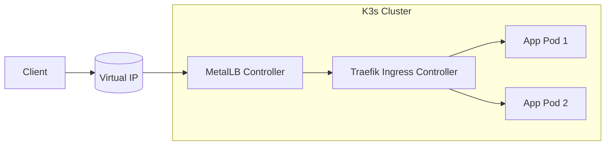
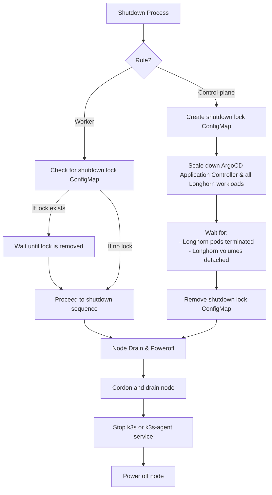

# Home K3s Cluster — Infrastructure as Code

This repository defines the **Infrastructure as Code (IaC)** setup for an **home K3s cluster**.
It was built as a learning project to explore Kubernetes operations, but primarily serves to host personal workloads in a modular, automated, and reproducible environment.

The following tools form the foundation of the cluster's provisioning, configuration, and workload management:

## Core Technologies

- **Ansible** – Used to bootstrap nodes, install dependencies, and configure system-level settings before joining the cluster.
- **Terraform** – Manages all cluster resources declaratively, including Helm releases, namespaces, secrets, and Argo CD applications.
- **K3s** – A lightweight Kubernetes distribution optimized for edge and home lab setups.
- **Helm** – Handles installation and configuration of complex applications via reusable charts.
- **Kubernetes Manifests** – Define workloads, services, ingress rules, and other cluster resources in YAML.

Here’s your updated **Cluster Components** section with a short, natural mention of your MikroTik-based home network and the link to your router configuration:

## Cluster Components

The cluster consists of three physical nodes:

- 🐮 **cow** – Raspberry Pi 5 (8GB RAM)
  Acts as the control-plane node, managing cluster state and system components.

- 🐑 **sheep** – Raspberry Pi 5 (16GB RAM)
  Serves as a general-purpose worker, running core services and lightweight workloads.

- 🦆 **duck** – Lenovo ThinkCentre M910q (i7, 32GB RAM)
  Dedicated to AI workloads and compute-heavy tasks. Normally powered off and started on demand.

The cluster runs on my **MikroTik-based home network**. You can find the network configuration and automation [here](https://github.com/Schwitzd/IaC-HomeRouter).

## Deployment Workflow

### Configure Nodes (Ansible)

```sh
ansible-playbook -i inventory.yaml k3s.yaml --tags <tag-name>
```

### Preparing Terraform

```sh
terraform init
terraform plan
```

## K3s

K3s is currently installed manually on each node using the official installation script.
While automating this step with Ansible would be ideal, I opted for manual installation due to limited time and haven't yet explored what's already available in the community.

### Secrets management

Secrets in my cluster are managed natively by K3s, using the `--secrets-encryption` flag during installation.
This flag enables **secret encryption at rest**, ensuring that all `Secret` resources are encrypted using AES-CBC with an auto-generated key stored on disk (typically at `/var/lib/rancher/k3s/server/tls`).

While this provides basic protection, it's important to understand the limitations:

- The encryption key is stored on disk, on the same machine as the data.
- Anyone with root access can potentially access and decrypt the secrets.
- Key rotation must be performed manually.

A more robust secret management system like Vault is on the roadmap.

## Deploying resources

This section outlines the recommended order to deploy the **core services** into K3s cluster.  
Following this sequence ensures proper service dependencies and seamless integration between networking, ingress, and TLS management components.

## CoreDNS

CoreDNS is the internal DNS server for service discovery and cluster DNS resolution in K3s. It is automatically deployed by K3s during cluster installation. However, this deployment method has limitations regarding service customization. The complex logic I developed to shut down or restart the cluster requires adding a toleration to CoreDNS. For this reason, I opted to install CoreDNS with the official Helm chart rather than with the K3s installation script.

To deploy CoreDNS:

```sh
terraform apply --var-file=variables.tfvars --target=argocd_application.coredns
```

### Certificates

To manage TLS certificates in the cluster, we use **Cert-Manager** with a **DNS-01 challenge**.
To deploy Cert-Manager:

```sh
terraform apply --var-file=variables.tfvars --target=helm_release.cert_manager
```

### Networking

All services in the cluster are exposed through **Traefik**, which acts as the Ingress Controller.  
To expose Traefik externally using a `LoadBalancer`, **MetalLB** is required to assign external IPs.

1. **Install MetalLB** (required for LoadBalancer support):

   ```sh
   terraform apply --var-file=variables.tfvars --target=helm_release.metallb
   ```

1. Deploy Traefik with LoadBalancer configuration:

    ```sh
    terraform apply --var-file=variables.tfvars --target=helm_release.traefik
    ```



### ArgoCD

**ArgoCD** manages the desired state of all applications and infrastructure deployed to the Home K3s cluster, providing a GitOps workflow for automated and repeatable deployments.

**How ArgoCD is Integrated**:

- **Project and App Management**: Each major category of workload (e.g., databases, monitoring, system, registry) is isolated into its own ArgoCD Project for RBAC and resource scoping. Applications are registered declaratively using Terraform, referencing charts and values from either OCI Helm registries or private Git repos (maybe one day I will opensource it).

- **Secrets**: Sensitive values are never stored in Git. Instead, Terraform provisions all required Kubernetes Secrets before ArgoCD syncs the relevant application. Charts are configured to reference these pre-existing secrets using their existingSecret fields wherever supported.

- **Automated Sync**: Most system and core workloads are set to sync automatically. ArgoCD will monitor and automatically apply any updates to charts or values files, as well as self-heal if resources drift from the declared state.

To deploy ArgoCD:

```sh
terraform apply --var-file=variables.tfvars --target=helm_release.argocd
```

### Storage

All Longhorn volumes are stored under `/mnt/nvme0/longhorn` on each node.

To deploy Longhorn:

```sh
terraform apply --var-file=variables.tfvars --target=argocd_application.longhorn
```

## Cluster Shutdown & Startup Workflow

This project implements a **role-aware, safe power cycle workflow** for the k3s cluster, designed to **reduce energy costs** by gracefully powering down all nodes when they are not needed—and reliably restoring full functionality at startup. Each node runs scripts generated by Ansible/Jinja2 with custom logic depending on its assigned role (`control-plane` or `worker`), ensuring no data loss and safe detachment of Longhorn volumes during shutdown, as well as seamless, automated recovery during startup.

### Shutdown

- **Shutdown Coordination:**

  - **Control-plane node** creates a *lock ConfigMap* to signal shutdown preparation.
  - **Worker nodes** watch for this lock; if present, they wait before proceeding to ensure the control-plane orchestrates a safe scale-down of ArgoCD and all Longhorn-dependent workloads.

- **Workload Teardown:**

  - The control-plane node scales all Deployments and StatefulSets using Longhorn storage (`storage=longhorn`) down to zero replicas.
  - The script waits until all Longhorn pods are terminated and all Longhorn volumes are detached before removing the shutdown lock ConfigMap.

- **Node Drain & Poweroff:**

  - Each node is cordoned and drained using Kubernetes to safely evict pods.
  - The appropriate k3s service (`k3s` for control-plane, `k3s-agent` for workers) is stopped.
  - Finally, the node is powered off.



> The entire shutdown process is orchestrated by the script:
> `/usr/local/bin/k3s-graceful-shutdown.sh`

### Startup

Startup process is much simpler: the `k3s-post-startup` service automatically uncordons the node, restoring it to normal scheduling. On the control-plane node, the service also scales up the **ArgoCD Application Controller**, enabling ArgoCD to reconcile and restore all Deployments and StatefulSets that were previously scaled down for a safe Longhorn shutdown.

> The entire post startup process is orchestrated by the script:
> `/usr/local/bin/k3s-post-startup.sh`

## Why Share?

I'm sharing this repository because I believe in the value of **open knowledge**.
By open-sourcing my setup, I hope it can help others looking to automate their **home infrastructure** with **K3s, Terraform, Ansible**, and good **security practices** — whether they're just learning or building something serious.

Collaboration and learning from each other is what makes the tech community thrive.

## To-Do

Tasks are listed in order of priority:

- [ ] Migrate all deployments to **Argo CD** (in progress)
- [ ] Refactor and improve the structure of the **Ansible codebase**
- [ ] Define and enforce network policies using Cilium
- [ ] Investigate whether it makes sense to deploy a **HashiCorp Vault** instance: currently, all secrets are encrypted and stored directly in K3s
