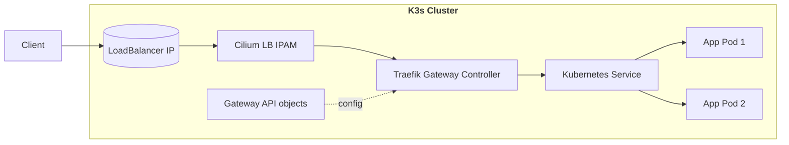
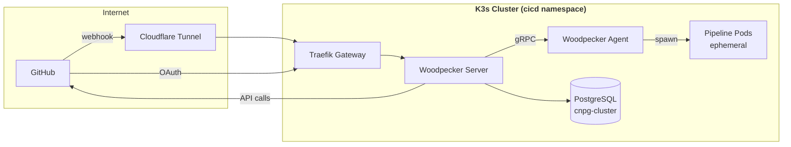
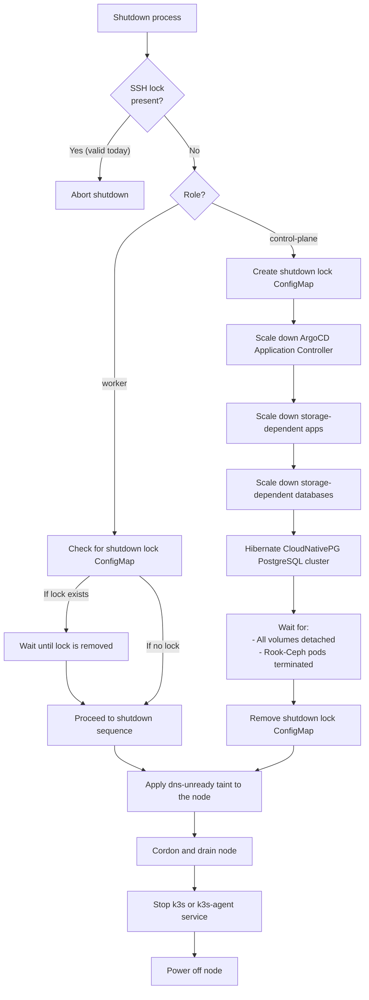
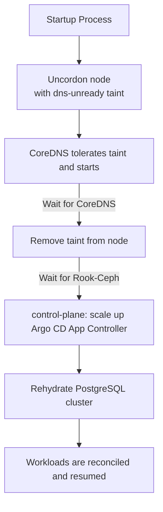

# Home K3s Farm Cluster

This repository defines the **Infrastructure as Code (IaC)** setup for my intentionally over-engineered **K3s home cluster**. It was built as a learning project to explore Kubernetes, but primarily serves to host personal workloads in an automated and reproducible environment.

The following tools form the foundation of the cluster's provisioning, configuration, and workload management:

## Core technologies

- **Ansible** – Used to bootstrap nodes, install dependencies, and configure system-level settings before joining the cluster.
- ~~**Terraform**~~ **OpenTofu** – Manages all cluster resources declaratively, including Helm releases, namespaces, secrets, and Argo CD applications.
- **K3s** – A lightweight Kubernetes distribution optimized for edge and home lab setups.
- **Helm** – Handles installation and configuration of complex applications via reusable charts.
- **Kubernetes Manifests** – Define workloads, services, ingress rules, and other cluster resources in YAML.

## Cluster components

The cluster consists of three physical nodes:

- 🐑 **sheep** – Raspberry Pi 5 (16GB RAM)
  Acts as the **control-plane** node, managing cluster state and system components.

- 🐮 **cow** – Raspberry Pi 5 (8GB RAM)
  Serves as a general-purpose worker, running core services and lightweight workloads.

- 🦆 **duck** – Lenovo ThinkCentre M910q (i7, 32GB RAM)
  Dedicated to AI workloads and compute-heavy tasks. Normally powered off and started on demand.

The cluster runs on my **MikroTik-based home network**. See the [network configuration and automation repository](https://github.com/Schwitzd/IaC-HomeRouter) for details.

## Networking

This cluster is configured as a **dual-stack environment**, supporting both IPv4 and IPv6 across all components, with IPv6 as the default. While IPv6 is not strictly required in my home network, it serves as a great opportunity to learn and experiment with it.

The networking stack is built around **Cilium**, which is responsible for:

- Providing **Container Networking (CNI)** using **eBPF**
- Replacing **kube-proxy** with eBPF-based service routing
- Managing **LoadBalancer IPs**, removing the need for an external component like MetalLB
- Enforcing **Kubernetes Network Policies**

### Network architecture

All cluster nodes are connected to a dedicated server VLAN with the following addressing:

- **IPv6:** `fd12:3456:789a:14::/64`
- **IPv4:** `192.168.14.0/26`

The Kubernetes **Pod and Service CIDRs** are defined for both address families:

| Purpose          | IPv4 CIDR            | IPv6 CIDR                   |
|------------------|----------------------|-----------------------------|
| Cluster Pods     | `10.42.0.0/16`       | `fd22:2025:6a6a:00::/56`    |
| Cluster Services | `10.43.0.0/16`       | `fd22:2025:6a6a:ff::/112`   |

The cluster operates under the `home.schwitzd.me` subdomain, delegated from the primary `schwitzd.me` zone. All internal services are exposed using FQDNs such as `pgadmin.home.schwitzd.me` and `grafana.home.schwitzd.me`.

## Secrets handling

The farm relies on two separate secret stores, each with a very different job.

The first one runs on my laptop. It's available right away, before the cluster even exists, and it holds only the minimum secrets I need to bootstrap everything: Argo CD, Azure Key Vault, and OpenBao. The second one is the farm Vault, deployed early in the cluster. Once it's up, it becomes the main place where all workload secrets live. Every app in the farm reads its secrets from here.

## Storage

Each Raspberry Pi in the cluster is equipped with a [Geekworm X1001](https://wiki.geekworm.com/X1001) M.2 HAT, providing fast local storage via NVMe SSDs.  
These disks are pooled together using **Rook-Ceph**, which handles replication, failover, and enables PersistentVolumeClaims (PVCs) to be shared across nodes.

I originally started with **Longhorn**, but after countless headaches with corrupted PVCs and unreliable volume detachment during shutdowns, I decided to switch to **Rook-Ceph**, which has proven far more stable and resilient — even though it requires significantly more resources and can be a bit overwhelming for a Raspberry Pi-based setup.

## Prerequisites

Create and activate a Python virtual environment (I'm using [Fish shell](https://fishshell.com/) in this example) and install the required dependencies:

```sh
python -m venv .venv
source .venv/bin/activate.fish
pip install -r requirements.txt
```

Initialize the OpenTofu environment:

```sh
tofu init
tofu plan
```

## Bootstrap the nodes

Before deploying any workloads, we first need to prepare the Raspberry Pi nodes to host the K3s cluster. Inside the `ansible/playbooks` folder, you'll find playbooks that handle the required system configuration.
Install the necessary Ansible roles and collections in order to use the playbooks:

```sh
cd ansible
ansible-galaxy role install -r requirements.yaml --force
ansible-galaxy collection install -r requirements.yaml --force
```

### IPv6 Networking

First step is to configure the network interface of each node with a static IPv6 address:

```sh
cd playbooks
ansible-playbook -i ../inventory.yaml bootstrap-ipv6.yaml \
  -u k3s \
  -K \
  --ask-pass \
  -e 'ansible_ssh_common_args="-o PubkeyAuthentication=no -o PreferredAuthentications=password -o IdentitiesOnly=yes -o StrictHostKeyChecking=no -o UserKnownHostsFile=/dev/null"'
```

### SSH & passwordless authentication

```sh
ansible-playbook -i ../inventory.yaml bootstrap-ssh.yaml --extra-vars "target=<node-name>" -u k3s --ask-pass -e 'ansible_ssh_common_args="-o PubkeyAuthentication=no -o PreferredAuthentications=password -o IdentitiesOnly=yes"'
```

This playbook performs the following:

- Generates an SSH key pair on the local machine (if not already present)
- Copies the public key to the target node and appends it to its ~/.ssh/authorized_keys
- Generates a temporary file in the directory `/tmp/<hostname-fqdn>_ed25519_passphrase.txt` that contains the passphrase

### K3s pre-requirements

Next, we apply the system-level configuration required to run K3s on the Raspberry Pi nodes:

This playbook performs the following:

- Sets up and mounts a Btrfs volume for persistent storage
- Applies SSH hardening and restricts access to the `k3s` user
- Enables memory cgroups required by K3s
- Add third-party repositories for Helm and Kubectl, then install the required packages
- Configures K3s environment variables for image garbage collection
- Prepare disk device and kernel module required by Rook Ceph
- Deploys graceful shutdown and startup scripts + systemd units
- Configures and enables a cron job to automatically shut down the cluster safely

```sh
ansible-playbook -i ../inventory.yaml k3s.yaml --tag <tag-name> -K
```

Because the playbook `k3s.yaml` contains tasks that must be run before and after the K3s installation, a controlled deployment is strongly suggested. Before installing K3s, run the following tags in order:

- sshd
- apt
- k3s-cgroup
- k3s-install-config

Follow the [next chapter](#k3s-installation) section to deploy K3s. Once it is installed, run the following Ansible tags in order:

- k3s-cilium
- k3s-rook-ceph
- k3s-post
- k3s-config,k3s-config-local,k3s-aliases
- shutdown-startup

Once Kubernetes has been installed and all the Ansible tags applied, we can start deploying resources to the cluster.

## K3s installation

K3s is currently installed manually on each node using the official installation script. While automating this step with Ansible would be ideal, I opted for manual installation due to limited time and haven't yet explored what's already available in the community. The following sections outline how both the **control-plane** and **worker** nodes are installed using the official K3s script.

Before running the installer, make sure the `k3s-install-config` Ansible tag has been applied. It creates `/etc/rancher/k3s/config.yaml` on each node with all the required parameters (node IPs, CIDRs, disabled components, etc.). K3s reads this file automatically at startup, so no flags need to be passed to the install script.

```sh
## Control-plane node
curl -sfL https://get.k3s.io | INSTALL_K3S_VERSION="<desired-version>" sudo sh -

## Worker node
# Get the node token from the control-plane
sudo cat /var/lib/rancher/k3s/server/node-token

# Installation
curl -sfL https://get.k3s.io | sudo INSTALL_K3S_VERSION="<desired-version>" K3S_URL=https://<CONTROL_PLANE_HOSTNAME>:6443 K3S_TOKEN=<NODE_TOKEN> sh -
```

While it's not best practice to manage the cluster directly from the **control-plane** node, I do so here for the sake of simplicity and ease of local development.

To streamline day-to-day operations, I configure `kubectl` on the **control-plane** like this:

```sh
# Set up kubectl config
mkdir -p ~/.kube
sudo cp /etc/rancher/k3s/k3s.yaml ~/.kube/config
sudo chown $USER ~/.kube/config
sudo chmod 600 ~/.kube/config
export KUBECONFIG=~/.kube/config

# Optional: Enable kubectl autocompletion
echo "source <(kubectl completion bash)" >> ~/.bashrc
source ~/.bashrc
```

Once the **control-plane** node is installed, you will notice that it is in the `NotReady` state. This is expected, because no **CNI** is installed at this stage. To resolve this **Cilium** must be deployed to the cluster. But before doing this making sure that at least one **worker** node is already joined to the cluster so **Cilium** pods can be scheduled successfully.

First, go back to the [K3s Pre-requirements](#k3s-pre-requirements) section to provision the missing tags, then proceed with the deployment of **Cilium**.

## Deployment workloads

This readme describes the recommended order for deploying the **core services** of the K3s farm cluster. These components form the foundation for networking, ingress, and certificate management, so bringing them up in the correct sequence avoids dependency issues.

A small group of essential services must exist before **Argo CD** is available. For these components, I use a **dual deployment strategy**:

1. They are first deployed with OpenTofu to bootstrap the cluster
1. Once Argo CD is running, they are handed over to GitOps and managed by Argo CD using ApplicationSet controller.

All remaining workloads, everything beyond the core services, are created and managed **exclusively** through the ApplicationSet controller.

### Secrets management

Secrets in my cluster are managed natively by K3s, using the `--secrets-encryption` flag during installation.
This flag enables **secret encryption at rest**, ensuring that all `Secret` resources are encrypted using AES-CBC with an auto-generated key stored on disk (typically at `/var/lib/rancher/k3s/server/tls`).

While this provides basic protection, it's important to understand the limitations:

- The encryption key is stored on disk, on the same machine as the data.
- Anyone with root access can potentially access and decrypt the secrets.
- Key rotation must be performed manually.

A more robust secret management system like Vault is on the roadmap.

### Networking with Cilium

Since **Cilium** is such a critical component of the cluster's networking stack, it must be deployed early in the cluster lifecycle, before any workloads or services can function properly.  
K3s is configured without a default CNI or kube-proxy, making the installation of Cilium the first essential step after setting up the nodes.

The deployment process follows the standard dual-step approach required when dealing with Kubernetes CRDs:

```sh
# Step 1: Install Cilium with CRDs
tofu apply --var-file=variables.tfvars --target=helm_release.cilium

# Step 2: Apply IPPool and L2 announcement CRs after CRDs are ready
tofu apply --var-file=variables.tfvars --target=kubernetes_manifest.cilium_ip
tofu apply --var-file=variables.tfvars --target=kubernetes_manifest.cilium_l2
```

> [!NOTE]
> `depends_on` is not sufficient in this case because OpenTofu resolves CRDs during the planning phase — not at apply time. This is why the manifests must be applied in a separate step after Cilium is installed.

After deploying **Cilium** itself, we apply the fundamental network policies to allow the core workloads (like DNS, Ingress, and cert-manager) to communicate successfully:

```sh
tofu apply --var-file=variables.tfvars --target=kubernetes_manifest.network_policies
```

> [!WARNING]
> At this stage the previous command only allows fundamental policies that enable the core services of the cluster to communicate with each other. However, I expect that some **Cilium policy violations** will occur. Please refer to the troubleshooting section, [Cilium network policies](#cilium-network-policies), for guidance on identifying and resolving these issues.
In addition, at the time of writing, the Hubble UI primarily focuses on pod-to-pod traffic. Dropped traffic originating from the `host` or `remote-node` may not be visible in the UI. For full visibility, including host-level and remote-node policy drops, use the **Hubble CLI**.

The **Cilium CLI** is installed automatically on the **control-plane** node via a dedicated **Ansible role**, allowing easy access to status and observability features like `cilium status` and `cilium monitor`.

### CoreDNS

**CoreDNS** acts as the internal DNS server for service discovery and cluster DNS resolution in K3s. It is deployed automatically by K3s during cluster installation. However, this deployment method has limitations with regard to service customisation. The complex logic that I developed to shut down or restart the cluster requires a toleration to be added to **CoreDNS**. For this reason, I chose to install CoreDNS using the official Helm chart instead of the K3s installation script.

Once **Argo CD** is up, bring it under GitOps management:

```sh
tofu apply --var-file=variables.tfvars --target=helm_release.coredns
```

### Certificates

TLS certificate management in the cluster is handled by **Cert-Manager**. This setup supports two main scenarios:

- **Public domain certificates**: issues certificates signed for my public domain (via [DNS-01 challenge](https://letsencrypt.org/docs/challenge-types/#dns-01-challenge)) so I can securely access workloads within my home.
- **Internal self-signed CA**: a separate, private certificate authority (CA) is managed by **Cert-Manager** to encrypt internal service-to-service traffic within the cluster.

Due to how **OpenTofu** handles Kubernetes CRDs, you **must** install **Cert-Manager** and its CRDs first, then deploy the `ClusterIssuer` resource in a second step. **OpenTofu** can only resolve CRDs that exist at plan time, so this split is required.

To deploy **Cert-Manager** and the `ClusterIssuer` correctly:

```sh
# Step 1: Install Cert-Manager with CRDs
tofu apply --var-file=variables.tfvars --target=helm_release.cert_manager

# Step 2: Deploy ClusterIssuer public domain
tofu apply --var-file=variables.tfvars --target=kubernetes_manifest.le_clusterissuer
```

> [!NOTE]
> `depends_on` is not sufficient here because OpenTofu resolves CRDs during the planning phase, not at apply time.

#### Farm CA

Because the internal **Farm CA** (the cluster's private certificate authority) is managed by **cert-manager**, and many core services depend on it, it needs to be bootstrapped early in the cluster lifecycle.

This is a one-time chicken-and-egg process: the Farm CA certificate is signed by a temporary self-signed `ClusterIssuer` (`selfsigned-bootstrap`) that is removed once the CA is in place.

1. In `apps/farm/farm-ca/`, uncomment `clusterissuer-selfsigned-bootstrap.yaml` and re-enable its entry in `kustomization.yaml`. Commit and push this together with `app.yaml` — ArgoCD's ApplicationSet will auto-discover the app and deploy all manifests in one sync.

    ```yaml
    ---
    apiVersion: cert-manager.io/v1
    kind: ClusterIssuer
    metadata:
      name: selfsigned-bootstrap
    spec:
      selfSigned: {}
    ```

2. Wait until the Secret `farm-ca-keypair` appears in the `pki` namespace, confirming the CA was successfully issued:

    ```sh
    kubectl -n pki get secret farm-ca-keypair
    ```

3. Comment out `clusterissuer-selfsigned-bootstrap.yaml` in both the file itself and in `kustomization.yaml`, then commit and push. ArgoCD will automatically prune the bootstrap issuer on the next sync.

#### Trust Manager

**trust-manager** distributes only the CA certificate (not the private key) to workloads that need to trust it, enabling safe rotation when your CA changes.

[Read more about why this separation matters in the official trust-manager docs.](https://cert-manager.io/docs/trust/)

Commit and push `apps/farm/trust-manager/app.yaml` to the GitOps repository — ArgoCD's ApplicationSet will auto-discover and deploy it.

By default, **trust-manager** does not have access to secrets in all namespaces. Only explicitly authorized secrets can be distributed — in this setup, only `farm-ca-bundle`:

```yaml
secretTargets:
  enabled: true
  authorizedSecretsAll: false
  authorizedSecrets:
    - farm-ca-bundle
```

The CA is distributed via a `Bundle` resource. Distribution is restricted to namespaces labelled `farm/sync-ca: "true"` rather than syncing to every namespace:

```yaml
apiVersion: trust.cert-manager.io/v1alpha1
kind: Bundle
metadata:
  name: farm-ca-bundle
  namespace: pki
spec:
  sources:
    - secret:
        name: farm-ca-keypair
        key: ca.crt
  target:
    secret:
      key: ca.crt
      metadata:
        labels:
          app.kubernetes.io/component: "trust-bundle"
    namespaceSelector:
      matchLabels:
        farm/sync-ca: "true"
```

### Gateway API with Traefik

External traffic is routed using the Kubernetes [Gateway API](https://gateway-api.sigs.k8s.io/) instead of the [traditional Traefik Ingress](https://doc.traefik.io/traefik/reference/install-configuration/providers/kubernetes/kubernetes-ingress/). **Traefik** runs as the [Gateway API controller](https://gateway-api.sigs.k8s.io/implementations/) and is exposed through LoadBalancer IPs provided by **Cilium**.

Using the official Helm chart, Traefik deploys the Gateway API controller and advertises a [GatewayClass](https://gateway-api.sigs.k8s.io/api-types/gatewayclass/?h=gatewayclass). Instead [Gateway](https://gateway-api.sigs.k8s.io/api-types/gateway/) resources are defined and managed declaratively in Git: a **minimal Gateway** is bootstrapped only to expose **Argo CD**, after which Argo is responsible for managing additional Gateways, listeners, and routes.

Each service uses a **dedicated HTTPS listener and certificate**, following the Gateway API model of [TLS termination per SNI](https://gateway-api.sigs.k8s.io/guides/tls/#listeners-with-different-certificates).

To deploy **Traefik** initially with OpenTofu:

```sh
# Deploy Traefik with the offical Helm Chart
tofu apply --var-file=variables.tfvars --target=helm_release.traefik

# Bootstrap a minimal Gateway for Argo CD
tofu apply --var-file=variables.tfvars --target=kubernetes_manifest.traefik_gateway
```

This two-step bootstrap ensures that the GatewayClass and controller exist before creating the initial Gateway used to expose Argo CD.

The diagram below illustrates how external traffic reaches workloads in the cluster using **Cilium** for LoadBalancer IP management and **Traefik** as the Gateway controller:


```mermaid
graph LR
    Client[Client] --> VIP[(LoadBalancer IP)]

    subgraph K3s["<b>K3s Cluster</b>"]
      direction LR
      VIP --> Cilium[Cilium LB IPAM]
      Cilium --> Traefik[Traefik Gateway Controller]
      Traefik --> SVC[Kubernetes Service]
      SVC --> Pod1[App Pod 1]
      SVC --> Pod2[App Pod 2]

      GatewayAPI[Gateway API objects] -. config .-> Traefik
    end
```

### Argo CD

**Argo CD** manages the desired state of all applications and infrastructure deployed across my clusters, providing a GitOps workflow for automated and repeatable deployments.

**How Argo CD is Integrated**:

- **Project and App Management**: Each major category of workload (e.g., databases, observability, system, registry) is isolated into its own Argo CD Project for RBAC and resource scoping. Applications are registered declaratively using OpenTofu, referencing charts and values from either OCI Helm registries or private Git repos (maybe one day I will opensource it).

- **Deployment**: Workloads are automatically created as **Argo CD** applications using the [ApplicationSet controller](https://argo-cd.readthedocs.io/en/latest/operator-manual/applicationset/), which leverages the [Git generator in file mode](https://argo-cd.readthedocs.io/en/latest/operator-manual/applicationset/Generators-Git/#git-generator-files). The ApplicationSet manifest lives in this IaC repository (`terraform/argocd/apps-autodiscovery-farm.yaml`) and is bootstrapped directly via OpenTofu.

- **Self-management**: Once the ApplicationSet is running, ArgoCD manages itself like any other app.

- **Secrets**: Sensitive values are never stored in Git. Instead, OpenTofu provisions all required Kubernetes Secrets before **Argo CD** syncs the relevant application. Charts are configured to reference these pre-existing secrets using their `existingSecret` fields wherever supported.

- **Clusters**: Argo CD is used as a central control plane for all Kubernetes clusters in my home landscape, including the VPS and Home Assistant K3s nodes. Each cluster is registered explicitly and managed through dedicated projects and service accounts, allowing the individual K3s clusters to remain lightweight and dedicate their limited resources to workloads rather than additional management infrastructure.

1. Deploy **Argo CD** with a minimal Helm bootstrap:

    ```sh
    tofu apply --var-file=variables.tfvars --target=helm_release.argocd
    ```

1. Provision the TLS certificate used to securely expose it:

    ```sh
    tofu apply --var-file=variables.tfvars --target=kubernetes_manifest.argocd_tls
    ```

1. Register the GitOps repository that **Argo CD** will use as its source of truth:

    ```sh
    tofu apply --var-file=variables.tfvars --target=argocd_repository.gitops
    ```

1. Bootstrap the ApplicationSet, which triggers auto-discovery of all apps, including ArgoCD itself:

    ```sh
    tofu apply --var-file=variables.tfvars --target=kubernetes_manifest.apps_autodiscovery_farm
    ```

At this point, the core infrastructure services are deployed into the cluster via OpenTofu/Helm, and Argo CD is running. However, these services are not yet managed by GitOps. The next step is to bring them under Argo CD management by creating `app.yaml` descriptors in the GitOps repository.

The ApplicationSet controller continuously scans `apps/farm/*/app.yaml` for application descriptors. To bring existing services under GitOps management, create an `app.yaml` file for each of these core services:

- ArgoCD (so it manages itself)
- Traefik
- Cilium
- network-policies
- CoreDNS
- Cert-Manager

Once these applications appear in the GitOps repository with their `app.yaml` files, Argo CD will auto-discover and manage them declaratively — including managing itself via `apps/farm/argocd/`. From that point forward, all configuration changes flow through Git, and all remaining workloads are deployed exclusively through the ApplicationSet auto-discovery mechanism.

For a detailed walkthrough of this transition from OpenTofu-managed deployments to ApplicationSet-driven GitOps, see my blog post: [ArgoCD: from OpenTofu to ApplicationSet](https://www.schwitzd.me/posts/argocd-from-opentofu-to-applicationset/).

#### Remote Clusters

To centrally manage remote clusters, a Kubernetes secret of type `cluster` is created in the `argocd` namespace on the Farm cluster. This secret is labeled with `argocd.argoproj.io/secret-type: cluster` so ArgoCD recognises it as a remote cluster registration.

```sh
tofu apply --var-file=variables.tfvars --target=kubernetes_secret_v1.argocd_cluster_vps_secret
```

### Storage with Rook-Ceph

The default storage pool is named `haystack`, inspired by the idea of a place where valuable things are safely tucked away. It holds all the cluster's persistent data and serves Persistent Volume Claims (PVCs) used by workloads that need to retain data across pod restarts and rescheduling. Workloads reference it via the `haystack-block` StorageClass.

Rook-Ceph is deployed using **Argo CD** and is composed of two main components:

- **The Operator**, which acts as a controller that manages the lifecycle of Ceph resources inside the cluster.
- **The Cluster**, which defines how Ceph itself is configured — including monitors, OSDs, storage pools, and more.

Once the cluster is deployed, retrieve the Dashboard login password by running the following command:

```sh
kubectl -n rook-ceph get secret rook-ceph-dashboard-password -o jsonpath='{.data.password}' | base64 -d
```

### OpenBao & ESO

**[OpenBao](https://openbao.org/)** is an open source fork of HashiCorp Vault and serves as the central secrets manager across the entire infrastructure. It runs on the Farm cluster and is sealed using **Azure Key Vault** for automatic unseal on restart.

**[External Secrets Operator (ESO)](https://external-secrets.io/)** bridges OpenBao and Kubernetes by reading secrets from OpenBao and syncing them into native Kubernetes `Secret` objects that workloads can consume normally. ESO is deployed on every cluster so that both Farm and remote clusters (e.g., VPS) can reach the Farm's OpenBao instance to retrieve secrets.

`SecretStore` and `ClusterSecretStore` resources, which define how each cluster authenticates to OpenBao, are managed in the dedicated **[IaC-SecretsStore](https://github.com/Schwitzd/IaC-SecretsStore)** repository. Secrets themselves are never stored in git.

> [!NOTE]
> For full details on the OpenBao setup, ESO configuration, and secret organization, see the dedicated README in that repository.

### PostgreSQL with CloudNativePG

After Bitnami announced they would retire their community-maintained Helm charts and shift toward a commercial offering focused on secure, production-ready images, [as detailed in this announcement](https://news.broadcom.com/app-dev/broadcom-introduces-bitnami-secure-images-for-production-ready-containerized-applications), I began searching for a Kubernetes-native alternative to manage my PostgreSQL databases.

That's when I discovered **[CloudNativePG](https://cloudnative-pg.io/)**: an open-source, CNCF-hosted operator built specifically for running PostgreSQL on Kubernetes.

What makes CloudNativePG great:

- **Kubernetes-native lifecycle management**: PostgreSQL clusters, roles, databases, backups, failover behavior, and bootstrap scripts are all defined declaratively using Custom Resources (CRs).
- **Built-in high availability**: Supports multi-instance clusters with synchronous replication and automatic failover.
- **Self-healing**: Automatically promotes a new primary if the current one goes down.

Just like the rest of my stack, **CloudNativePG** is fully managed via Argo CD. It consists of two key components:

- **The Operator** – Monitors and reconciles `Cluster` resources and automates the full PostgreSQL lifecycle.
- **The Cluster** – A declarative resource that defines the PostgreSQL setup: replicas, storage, authentication, and init logic.

Databases and roles are both managed declaratively:

- **Databases** are defined as `Database` custom resources and applied alongside the cluster via Argo CD. Each app gets its own database with a dedicated owner.
- **Roles** are declared directly in the `Cluster` spec under `managed.roles`, with passwords never stored in git.

Each role and the superuser have their own dedicated secret in OpenBAO, each storing a `username` and `password` pair. ESO syncs them into the `database` namespace as `kubernetes.io/basic-auth` secrets, which CNPG then references directly.

<details>
<summary>OpenBAO secret structure for CNPG</summary>

```text
farm/database/
└── cnpg/
    ├── superuser
    │   ├── username
    │   └── password
    ├── backup
        │   ├── access_key_id
        │   └── secret_access_key
    └── roles/
        ├── <app-name>
        │   ├── username
        │   └── password
        ├── ...
```
</details>  

The cluster TLS certificate is issued internally by my farm CA via cert-manager, keeping PostgreSQL traffic encrypted within the cluster without any external exposure.

### Woodpecker

Every farm needs a good worker that shows up, does the job, and disappears without leaving a mess. [Woodpecker](https://woodpecker-ci.org/) is that worker, it is the CI/CD engine of the farm, wired to **GitHub** and ready to run pipelines whenever code lands.

When a pipeline fires, Woodpecker instructs the Kubernetes API to spin up ephemeral pods in the `cicd` namespace, one per step, and tears them down the moment they are done. All state lives in the shared **PostgreSQL** cluster, so nothing important is ever stuck inside a container.

Since the farm does not expose itself to the internet, GitHub webhooks need a way through the fence. I route them via a **Cloudflare Tunnel**, keeping the ingress private while still letting GitHub knock on the door reliably.


```mermaid
graph LR
    subgraph Internet
        GH[GitHub]
        CF[Cloudflare Tunnel]
    end

    subgraph K3s["<b>K3s Cluster (cicd namespace)</b>"]
        direction LR
        Traefik[Traefik Gateway]
        Server[Woodpecker Server]
        Agent[Woodpecker Agent]
        CNPG[(PostgreSQL\ncnpg-cluster)]
        Pods[Pipeline Pods\nephemeral]

        Traefik --> Server
        Server -- gRPC --> Agent
        Server --> CNPG
        Agent -- spawn --> Pods
    end

    GH -- webhook --> CF --> Traefik
    GH -- OAuth --> Traefik
    Server -- API calls --> GH
```

<details>
<summary>OpenBAO secret structure for Woodpecker</summary>

```text
farm/woodpecker/
└── woodpecker/
    ├── github
    │   ├── client-id
    │   └── client-secret
    └── db
        └── datasource

farm/database/
└── cnpg/
    └── roles/
        └── woodpecker
            ├── username
            └── password
```
</details>

### IdP with Keycloak

The **Farm realm** is bootstrapped at deploy time via a realm import embedded in the Helm values (login settings, password policy, roles, and groups). Client applications (OIDC clients) are managed separately in the dedicated **Farm-Realm** private repository, which keeps client configuration as code and decouples it from the cluster infrastructure.

A **Woodpecker CI pipeline** in that repository uses [keycloak-config-cli](https://github.com/adorsys/keycloak-config-cli) to apply client definitions to Keycloak on every push to `main`. Each client is declared as a YAML file under `clients/`. Adding a new file creates or updates the corresponding Keycloak client, and clients not defined in the repo are left untouched.

### Garage

I decided to switch from MinIO to **Garage** after [MinIO's removal of key features from the community edition](https://github.com/minio/object-browser/pull/3509). MinIO is following a "Redis momentum" and almost all functionality are now available only in the enterprise tier.

Garage is managed by the [garage-operator](https://github.com/rajsinghtech/garage-operator), which handles the full lifecycle of the cluster via Kubernetes CRDs: `GarageCluster` defines the storage nodes and replication, while `GarageBucket` and `GarageKey` manage buckets and access credentials declaratively. This replaces the previous approach of manual Helm chart deployment with bootstrap Jobs.

The operator provisions a web UI ([garage-ui](https://github.com/Noooste/garage-ui)) that provides a browser-based interface for managing buckets and keys. Access is protected via **OIDC authentication** through Keycloak, with users required to hold the `admin` client role on the `garage-ui` client before they can log in.

<details>
<summary>OpenBAO secret structure for Garage</summary>

```text
farm/storage/
└── garage/
    ├── admin
    │   └── admin-token
    └── ui
        └── client-secret
```

</details>

### Observability stack

To keep an eye on the health, performance, and behavior of the farm (ehm, *cluster*), I use a classic combo: Prometheus for metrics collection and Grafana for dashboards and visualization.

All dashboards are managed as code in my GitOps repo, and the Grafana dashboard sidecar auto-discovers and loads them into the UI. The connection to Prometheus as a data source is also defined and reconciled as code, making observability fully GitOps-managed, with Argo CD keeping it all in sync.

> [!NOTE]
> For each app you want to monitor, be sure to enable the relevant metrics exporter in its Helm charr. Otherwise, Prometheus won't see any data for that workload.

#### Dashboards

| Name                          | Description                            | Grafana ID                                                           |
|-------------------------------|----------------------------------------|----------------------------------------------------------------------|
| grafana-dashboards-kubernetes | Set of dashboards for K8s              | [Github](https://github.com/dotdc/grafana-dashboards-kubernetes)     |
| CloudNativePG                 | The official CloudNativePG dashboard   | [20417](https://grafana.com/grafana/dashboards/20417-cloudnativepg)  |
| Cilium Metrics                | The Cilium Metrics official dashboard  | [21431](https://grafana.com/grafana/dashboards/21431-cilium-metrics) |
| Traefik                       | The Traefik Metrics official dashboard | [17347](https://grafana.com/grafana/dashboards/17347-traefik-official-kubernetes-dashboard/) |

### Other workflows

All other workloads in the cluster, including databases, observability tools, and supporting services follow the same deployment pattern:

They are defined as **Argo CD Applications** and deployed using the following command:

```sh
tofu apply --var-file=variables.tfvars --target=Argo CD_application.<app-name>
```

## Cluster SSH connection

In theory, connecting to a cluster over SSH should not be difficult, but connecting to this cluster is a bit tricky. The challenge is that a [systemd timer](https://www.freedesktop.org/software/systemd/man/latest/systemd.timer.html) is executed daily to shut down the entire cluster (to avoid wasting electricity). The consequence is that if I'm connected to it and doing things, I get kicked out with a high risk of losing or corrupting the cluster. To solve this challenge, I added an `ssh-look` to the [shutdown logic](#shutdown). If it is present, the shutdown process is interrupted.

### SSH login

To create the `ssh-look`, I'm leveraging [fish functions](https://fishshell.com/docs/current/tutorial.html) by creating my klogin function in `.config/fish/functions/klogin.fish` (the Ansible task will follow).

```fish
function klogin
    if test (count $argv) -lt 1
        echo "Usage: klogin <host>"
        return 1
    end

    set -l host $argv[1]
    set -l fqdn "$host.schwitzd.me"
    set -l key  "$HOME/.ssh/$host.home.schwitzd.me_ed25519"

    # Run kubectl, then keep the session open with a login shell
    set -l remote_cmd "kubectl -n kube-system create ConfigMap ssh-lock-$host 2>/dev/null; exec bash -l"

    ssh -tt -i "$key" "k3s@$fqdn" -- "$remote_cmd"
end
```

This function does three things:

1. Connects to a remote node using a node-specific private key
1. Runs a kubectl command to create the `ssh-look` on that node
1. Drops you into an interactive login shell `bash -l`

### SSH logout

Logging out from the cluster simply reverts the login step. The `klogout` bash alias deletes the `ssh-lock` ConfigMap and then closes the SSH session.

## Cluster shutdown & startup workflow

This project implements a **role-aware, safe power cycle workflow** for the k3s cluster, designed to **reduce energy costs** by gracefully powering down all nodes when they are not needed—and reliably restoring full functionality at startup. Each node runs scripts generated by Ansible/Jinja2 with custom logic depending on its assigned role (`control-plane` or `worker`), ensuring no data loss and safe detachment of volumes during shutdown, as well as seamless, automated recovery during startup.

### Shutdown

The shutdown is a **coordinated sequence** led by the `control-plane` to ensure workloads stop cleanly.

1. **Coordination**
   The `control-plane` creates a shutdown lock ConfigMap in `kube-system`.
   `worker` nodes check for this lock and patiently wait, leaving orchestration to the `control-plane`.

2. **Silence ArgoCD**
   ArgoCD is scaled down before anything else. This prevents it from interfering with the shutdown by trying to immediately reconcile workloads.

3. **Shut down storage-dependent workloads in order**
   The `control-plane` handles workloads that rely on Rook-Ceph in a strict sequence:

   - First, applications labeled `storage=rook-ceph,shutdown=app` are scaled down.
   - Next, databases labeled `storage=rook-ceph,shutdown=db` are brought down.
   - Finally, the CloudNativePG cluster is annotated with `cnpg.io/hibernation=on`, and the script waits until all database pods terminate.

   This ensures applications stop before databases, and the database is fully hibernated before continuing.

4. **Clear the field**
   Once storage pods are gone and volumes detached, the shutdown lock is removed. At this point the cluster is ready for the final step.

5. **Drain and power off the node**
   Each node is tainted (`dns-unready=true:NoExecute`), cordoned, and drained to stop new workloads. The k3s service (`k3s` on control-plane, `k3s-agent` on workers) is stopped, and the system powers down.


```mermaid
flowchart TD
  A[Shutdown process] --> B{SSH lock <br/>present?}
  B -- "Yes (valid today)" --> Z[Abort shutdown]
  B -- "No" --> C{Role?}

  C -- "control-plane" --> D[Create shutdown lock ConfigMap]
  C -- "worker" --> E[Check for shutdown lock ConfigMap]
  E -- "If lock exists" --> F[Wait until lock is removed]
  F --> G[Proceed to shutdown sequence]
  E -- "If no lock" --> G

  D --> H[Scale down ArgoCD Application Controller]
  H --> I[Scale down storage-dependent apps]
  I --> J[Scale down storage-dependent databases]
  J --> K[Hibernate CloudNativePG PostgreSQL cluster]

  K --> L[Wait for:<br/>- All volumes detached<br/>- Rook-Ceph pods terminated]
  L --> M[Remove shutdown lock ConfigMap]

  G & M --> N[Apply dns-unready taint to the node]
  N --> O[Cordon and drain node]
  O --> P[Stop k3s or k3s-agent service]
  P --> Q[Power off node]
```

> [!NOTE]
> The entire shutdown process is orchestrated by the script:  
> `/usr/local/bin/k3s-graceful-shutdown.sh`  
>
> Logs for this process are written to:  
> `/var/log/k3s-graceful-shutdown.log`

### Startup

The startup process is coordinated by the `k3s-post-startup` systemd service, which ensures that workloads are scheduled only after the cluster is fully ready.

- **Startup Coordination:**

  - All nodes boot with the custom taint `dns-unready=true:NoExecute`, applied during shutdown to block early workload scheduling.
  - **CoreDNS** is configured to tolerate this taint and is allowed to start immediately.

- **DNS Readiness & Workload Restoration:**

  - The `k3s-post-startup` script waits until all **CoreDNS** pods are marked `Ready`.
  - Once DNS is confirmed operational:

    - The taint is removed from the current node.
    - The node is uncordoned, enabling workload scheduling.

- **control-plane logic**:

  - On the **control-plane** node, the script scales the **Argo CD Application Controller** back up, allowing reconciliation of all previously scaled-down workloads.


```mermaid
flowchart TD
  S1[Startup Process]
  S2[Uncordon node<br/>with dns-unready taint]
  S3[CoreDNS tolerates taint and starts]
  S5[Remove taint from node]
  S6[control-plane: scale up Argo CD App Controller]
  S7[Rehydrate PostgreSQL cluster]
  S8[Workloads are reconciled and resumed]

  S1 --> S2 --> S3 -- "Wait for CoreDNS" --> S5 -- "Wait for Rook-Ceph" --> S6 --> S7 --> S8
```

> [!NOTE]
> The entire startup process is orchestrated by the script:
> `/usr/local/bin/k3s-post-startup.sh`
>
> Logs for this process are written to:  
> `/var/log/k3s-post-startup.log`

## Miscellaneous

### K3s CLI aliases

To simplify frequent Kubernetes cluster operations, the following shell aliases are included:

| Alias    | Command                                                                 | Description                                                      |
|----------|-------------------------------------------------------------------------|------------------------------------------------------------------|
| `kwpods` | `watch kubectl get pods -A -o wide`                                     | Live-updating view of all pods (wide mode)                       |
| `kpods`  | `kubectl get pods -A -o wide`                                           | One-time snapshot of all pods (wide mode)                        |
| `koff`   | `sudo systemctl start k3s-graceful-shutdown@remove-ssh-lock.service`    | Trigger a graceful shutdown of the cluster                       |
| `klogin` | `kubectl -n kube-system create configmap ssh-lock-$(hostname) --from-literal=date=$(date -u +%F) --dry-run=client -o yaml \| kubectl apply -f -` | Create an SSH lock for the current node (local machine)          |
| `klogout`| `kubectl -n kube-system delete configmap ssh-lock-$(hostname) --ignore-not-found \; logout` | Remove the SSH lock for the current node and close SSH session |

### Naming convention

To ensure consistency, clarity and maintainability across the cluster, I will follow the naming convention for almost all resources that I create. This approach makes it easier to identify the purpose of each object at a glance.

Below is the naming schema used across the cluster:

| Resource Type         | Format                  | Example                 |
|-----------------------|-------------------------|-------------------------|
| Certificate (generic) | `tls-<name>`            | `tls-dashboard`         |
| Certificate (ingress) | `tls-<name>-ingress`    | `tls-dashboard-ingress` |
| ClusterRole           | `cr-<name>`             | `cr-read-only`          |
| ClusterRoleBinding    | `crb-<name>`            | `crb-admin-binding`     |
| ConfigMap             | `cm-<name>`             | `cm-grafana-dashboards` |
| CronJob               | `cron-<task>`           | `cron-db-backup`        |
| ExternalSecret        | `eso-<name>`            | `eso-rancher-bootstrap` |
| Job                   | `job-<task>`            | `job-schema-migration`  |
| PVC                   | `pvc-<app>-(<purpose>)` | `pvc-postgres-data`     |
| Role                  | `role-<name>`           | `role-system-metrics`   |
| RoleBinding           | `rb-<name>`             | `rb-database-access`    |
| Secret (auth)         | `auth-<name>`           | `auth-admin`            |
| Secret (db auth)      | `auth-db-<name>`        | `auth-db-postgres`      |
| Secret (s3 auth)      | `auth-s3-<name>`        | `auth-s3-backup`        |
| Secret (ssh auth)     | `auth-ssh-<name>`       | `auth-ssh-router`       |
| Secret (api auth)     | `auth-api-<name>`       | `auth-api-cloudflare`   |
| Secret (generic)      | `secret-<purpose>`      | `secret-foo`            |
| ServiceAccount        | `sa-<name>`             | `sa-argocd`             |
| ServersTransport      | `st-<name>`             | `st-vault`              |

A lot of resources are created by the corresponding Helm chart, and it is not possible to decide on a name, or it is too overwhelming to change it.

## Troubleshooting

### Cilium network policies

At the early stage of the cluster setup, **Hubble** (Cilium's observability layer) is not yet deployed, so you won't be able to rely on its UI or CLI from outside the cluster.  
If a workload cannot be reached or network traffic is unexpectedly dropped, you can troubleshoot directly from the Cilium agent running on the affected node.

1. Identify the node where the workload is running:

    ```sh
    kubectl get pod -o wide -n <namespace>
    ```

1. Connect to the Cilium agent running on that node:

    ```sh
    kubectl -n kube-system exec -it cilium-<node-suffix> -- bash
    ```

1. Run Hubble locally to observe dropped packets:

    ```sh
    hubble observe --verdict DROPPED -f
    ```

  This will show you which flows are being denied by Cilium Network Policies.

Once **Hubble** is fully deployed in the cluster, troubleshooting becomes much easier. You can simply access the UI for a visual overview of network flows and dropped packets.

## To-Do

Tasks are listed in order of priority:

- [ ] Remove all deprecated codes and files (in progress)
- [ ] Add observability to all workloads, included Mikrotik (in progress)
- [ ] Evaluate    standalone with its operator + Grafana dashboard
- [ ] Gotify + alertify
- [ ] Review `securityContext`
- [ ] Write a desciption on all Ciliun policies and harmonize egress/ingress order and descriptions
- [X] OpenBao replace two-hop TLS with TLSRoute
- [X] Add Cilium API Gateway with K8s API Gateway (TLSRoute) support
- [X] Implement KeyCloak
- [X] Ansible task for fish `klogin` function
- [X] Garage Tofu provider for creating buckets
- [X] Investigate whether it makes sense to deploy a ~~**HashiCorp Vault**~~ **OpenBao**  instance: currently, all secrets are encrypted and stored directly in K3s
- [X] Think if make sense to create a selfsigned CA in cert-manager to improve TLS internal communication between pods
- [X] All SVC should be in dual-stuck
- [X] Migrate all deployments to **Argo CD** (in progress)
- [X] Add `revisionHistoryLimit` on my Helm charts
- [X] Replace MinIO with Garage
- [X] Enable Cilium
- [X] Enforce network policies using Cilium
- [X] Vulnerability scan for Harbor images
- [X] Move all OpenTofu locals to `locals.tf`
- [X] Refactor and improve the structure of the **Ansible codebase**
- [X] Switched from Terraform to OpenTofu

## Why share?

I'm sharing this repository because I believe in the value of **open knowledge**.
By open-sourcing my setup, I hope it can help others looking to automate their **home infrastructure** with **K3s, OpenTofu, Ansible**, and good **security practices** — whether they're just learning or building something serious.

Collaboration and learning from each other is what makes the tech community thrive.

## Closing words

To be honest, I'm convinced that I would not have been able to achieve some of my goals without ChatGPT. At the very least, it would have required much more effort and time than I currently have with a small child.

Personally, I used ChatGPT for repetitive tasks and to generate code, as well as for troubleshooting. The latter was mainly due to laziness and the misguided belief that it would be quicker. This is not necessarily wrong, because it works perfectly in some cases. But at other times, I found myself going down a rabbit hole, with the LLM providing solutions that were hallucinatory. The lesson I have learned is that there comes a time when you have to stop using it, because a simple search of the official documentation or good old Stack Overflow is much faster!

This project has been a fun and rewarding challenge. I hope it inspires or helps others who are building their own home infrastructure. This won't be the end of my journey, as my to-do list is growing and cloud-native technologies are evolving incredibly quickly.

Stay curious 🚀
